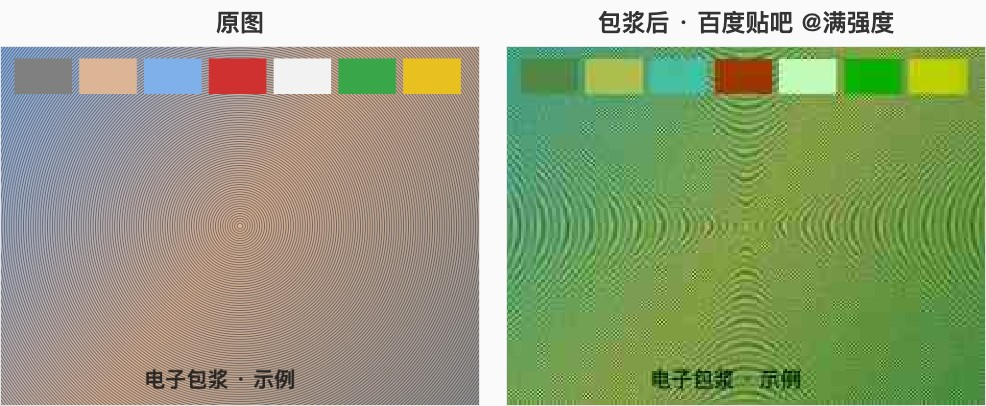

# 电子包浆生成器（完整版）

虽然百度贴吧的电子包浆最经典，但是我感觉电子包浆这个概念其实在各种平台和电子操作下都会出现，所以我做了这一套完整的，从多个角度切入的，电子包浆生成器（完整版）。

纯浏览器端处理,图片不会离开你的设备。



## 运行

```bash
npm install
npm run dev
```

## 预设

| 预设 | 味道 |
| --- | --- |
| 互联网经典 | 泛用型网络老化:反复 JPEG、缩放损失、噪点、偏色 |
| QQ 2008 | 冷蓝调、狠压缩、过度锐化、CRT 扫描线与光晕 |
| 百度贴吧 | 经典变绿、色度崩坏、锐化光边、反复压缩 |
| 微信转发 | 压到 640px、轻糊、截图痕迹、褪色 |
| 截图套截图 | 反复截图:状态栏残影、边缘漂移、尺寸缩水 |
| 手机屏摄 | 拿手机拍屏幕:透视畸变、失焦、真摩尔纹、眩光、传感器噪点 |
| 互联网活化石 | 所有算法轮番上阵若干轮 |

## 架构

- `lib/effects/` — 每个退化效果都是独立、可组合的纯函数(`compressJPEG`、`resizeRoundTrip`、`addNoise`、`simulateCRT`、`addMoire`、`simulateScreenshot`、`pixelate`、`addWatermark`…)
- 水印(致敬 [magiconch.com/patina](https://magiconch.com/patina/)):右下角「@用户名」白字带阴影,在管线最前面盖章,跟图一起包浆
- `lib/effects/pipelines.ts` — 预设 = 效果函数的组合;新预设只需拼装现有效果
- `lib/effects/random.ts` / `seed.ts` — 种子化随机:留空每次微妙不同,填种子则完全可复现
- 强度滑杆 0–100 平滑插值所有参数;预览在 ≤1600px 下运行以保证速度,下载时以原分辨率(≤6000px)重跑同一种子
- `lib/api.ts` — 后端 API 封装:预设列表、生成记录上报、「互联网年龄」与全站统计均来自
  [pindou-server](https://github.com/WierChan/pindou-server)(Spring Boot 3 + MySQL + MyBatis-Plus,私有仓库),
  前端不内置这些数据;后端未启动时页面会给出明确提示

技术栈:Next.js + TypeScript + TailwindCSS + shadcn/ui + Canvas;数据服务:Spring Boot 后端(patina-server,端口 7010)。

## 前后端联动

1. 先启动后端:[pindou-server](https://github.com/WierChan/pindou-server) 仓库下 `mvn spring-boot:run`(首次先执行 `sql/schema.sql` 建库)
2. 再 `npm run dev`,开发环境自动用 `.env.development` 里的 `http://localhost:7010`
3. 生产 `npm run build` 时 `NEXT_PUBLIC_API_BASE_URL` 留空 = 走同域 `/api`,由 Nginx 反代到后端 7010

图片处理仍然全部在浏览器完成,图片本体不上传;每次生成仅上报参数(预设/强度/种子/尺寸/耗时),由后端落库并返回「互联网年龄」。
